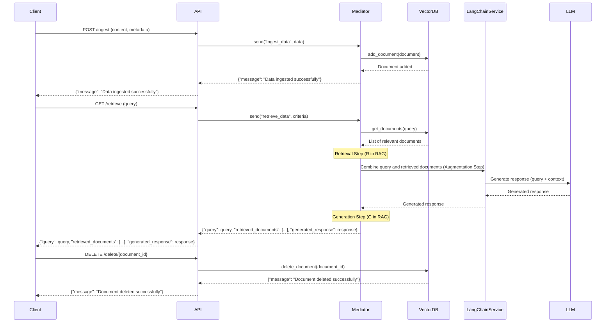
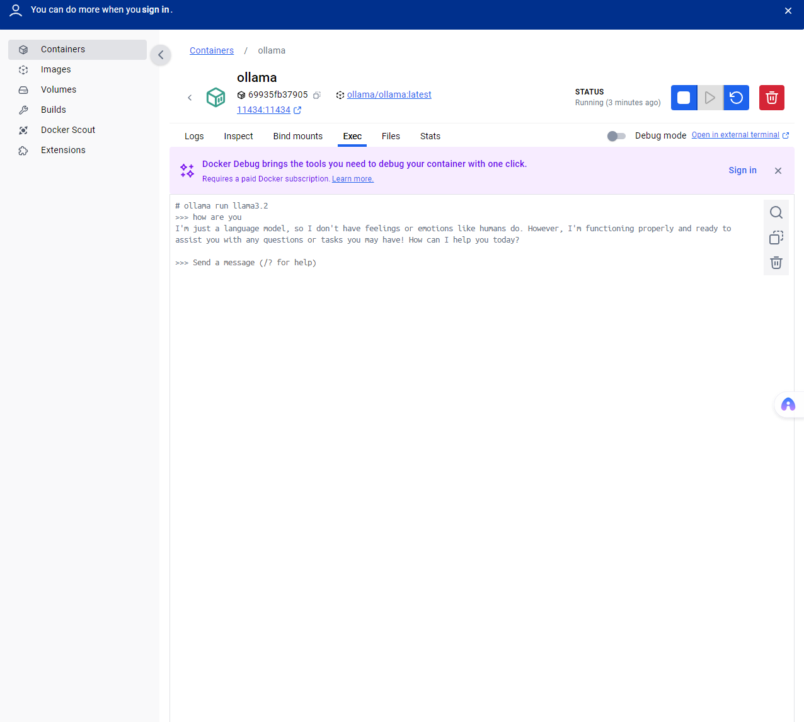

# Simple LangChain Retrieval-Augmented Generation System

This project implements a Retrieval-Augmented Generation (RAG) system using LangChain and a vector database. The architecture follows Clean Architecture principles and employs the Command Query Responsibility Segregation (CQRS) pattern.

## System Architecture

## LangChain RAG Ollama Demo


## Project Structure

```
langchain-rag-system
├── src
│   ├── application
│   │   ├── commands
│   │   │   └── ingest_data.py
│   │   ├── queries
│   │   │   └── retrieve_data.py
│   ├── domain
│   │   ├── entities
│   │   │   └── document.py
│   │   └── repositories
│   │       └── vector_db_repository.py
│   ├── infrastructure
│   │   ├── database
│   │   │   └── vector_db.py
│   │   └── services
│   │       └── langchain_service.py
│   ├── presentation
│   │   ├── api
│   │   │   └── main.py
│   │   └── cli
│   │       └── commands.py
│   └── tests
│       ├── test_application
│       ├── test_domain
│       ├── test_infrastructure
│       └── test_presentation
├── requirements.txt
├── .env
├── .gitignore
└── README.md
```
## Features

- **Ingestion**: Add documents to a FAISS-based vector database with metadata.
- **Retrieval**: Perform similarity searches using Sentence Transformers to retrieve relevant documents.
- **Augmentation**: Combine retrieved documents with the query to provide context for the LLM.
- **Generation**: Use an LLM (e.g., OpenAI's ChatGPT or Ollama) to generate responses based on the query and augmented context.
- **LangChain Integration**: Placeholder for LangChain-based processing and response generation.
- **Clean Architecture**: Separation of concerns with clearly defined layers (Application, Domain, Infrastructure, Presentation).
- **CQRS Pattern**: Commands for ingestion and queries for retrieval.

## Tech Stack

The project is built using the following technologies:

- **Python**: Core programming language for the project.
- **FastAPI**: Framework for building the RESTful API.
- **FAISS**: Vector database for efficient similarity search.
- **Sentence Transformers**: Pre-trained models for generating vector embeddings.
- **LangChain**: Framework for building applications with LLMs (Language Models).
- **Pydantic**: Data validation and settings management.
- **Uvicorn**: ASGI server for running the FastAPI application.
- **pytest**: Testing framework for unit and integration tests.
- **dotenv**: For managing environment variables.
- **ollama**: LLM (Language Models).

## Setup Instructions

1. **Clone the repository:**
   ```
   git clone https://github.com/yourusername/langchain-rag-system.git
   cd langchain-rag-system
   ```

2. **Create a virtual environment:**
   ```
   python -m venv venv
   source venv/bin/activate  # On Windows use `venv\Scripts\activate`
   ```

3. **Install dependencies:**
   ```
   pip install -r requirements.txt
   ```

4. **Configure environment variables:**
   Create a `.env` file in the root directory and add your configuration settings, such as database connection strings and API keys.

5. Start Ollama Using Docker Compose
```bash
docker-compose up -d
docker logs ollama
```

6. Verify Ollama is Running



```bash
docker ps
# please execute from docker command. go to docker desktop, click on ollama, then click on exec, should shows command
# Check Ollama
ollama --version
# Pull llama3.2 model
ollama pull llama3.2
# Run llama3.2 model
ollama run llama3.2

# Ollama API reference link: https://github.com/ollama/ollama/blob/main/docs/api.md
# Access from local using curl after pull llama3.2
curl http://localhost:11434/api/generate -d '{ "model": "llama3.2", "prompt": "How are you today?"}'
# The format of the default response is not very friendly, let's add additional parameters to generate a single json object data, and the response is the return content.
curl http://localhost:11434/api/generate -d '{ "model": "llama3.2", "prompt": "How are you today?", "stream": false}'
```

7. **Run the Application:**

#### Start the API Server

```bash
uvicorn src.presentation.api.main:app --reload
```

Access the API documentation at [http://127.0.0.1:8000/docs](http://127.0.0.1:8000/docs).

8. **Testing:**

Run the tests using `pytest`:

```bash
pytest src/tests
```

#### Test the API Endpoints

Use the `apitest/api.http` file with the REST Client extension in Visual Studio Code to test the `/ingest` and `/retrieve` endpoints.

## Usage

### Ingesting Data

To ingest data into the vector database, use the command line interface:

```
python src/presentation/cli/commands.py ingest --file path/to/data.json
```

### Retrieving Data

To retrieve data based on specific criteria, use the following command:

```
python src/presentation/cli/commands.py retrieve --query "your search query"
```

## Testing

To run the tests, execute:

```
pytest src/tests
```

## Insert Test Data
```
Document 1:
The capybara is the largest rodent in the world and typically lives for about 8 to 10 years in the wild.

Document 2:
Frigatebirds are known to sleep while flying by shutting down one half of their brain at a time.

Document 3:
The African elephant has larger ears shaped like the African continent, while the Asian elephant has smaller, rounded ears. African elephants are generally larger and both males and females have tusks, whereas only some male Asian elephants have tusks.

Document 4:
Axolotls are amphibians that live in lakes in Mexico. They are carnivorous and feed on small prey like worms, insects, and small fish.

Document 5:
Blue whales have a gestation period of approximately 11 to 12 months.
```

## Ask a Test Prompt
Now, you ask one of these test prompts through your interface. Examples:

✅ Prompt: "How long do capybaras live?"

✅ Expected retrieval: Document 1

✅ Expected output: "Capybaras typically live for about 8 to 10 years in the wild."

✅ Prompt: "Which bird can sleep while flying?"

✅ Should retrieve: Document 2

✅ Output: "Frigatebirds can sleep while flying by shutting down one half of their brain."

✅ Prompt: "What's the difference between African and Asian elephants?"

✅ Should retrieve: Document 3

## Contributing

Feel free to submit issues or pull requests to improve the project. Please ensure that your contributions adhere to the project's coding standards and include appropriate tests.

## License

This project is licensed under the MIT License. See the LICENSE file for details.